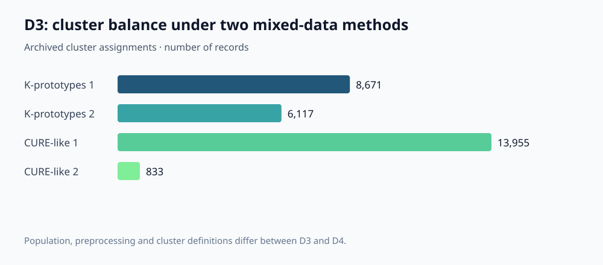
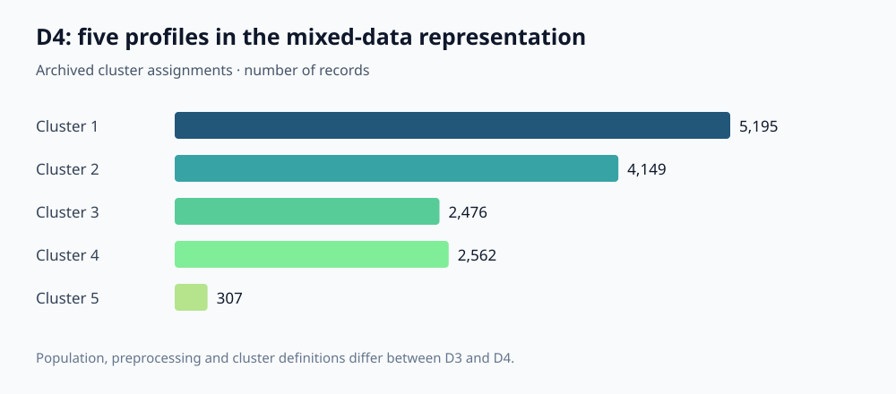

# US Traffic Accident Analytics

**From imperfect incident records to interpretable traffic profiles: data quality, multivariate statistics, mixed-data clustering, temporal patterns and geospatial analysis.**

A university team project that investigates how weather, infrastructure, time and location relate to recorded traffic incidents. Two successive deliverables, D3 and D4, form one analytical story: first make heterogeneous observations usable, then examine their structure through complementary statistical representations.

The result is an exploratory analysis in **R and Python**, with explicit preprocessing decisions, method comparisons, cluster profiling, geographic visualizations and topic models of incident descriptions. Its main value is connecting data quality with interpretation: a cluster or a map is useful only when its population, variables and assumptions are clear.

## Project at a glance

| Area | Implementation | Result or evidence |
|---|---|---|
| Data quality | Cleaning, missing-data methods, multi-method outlier checks and feature engineering | Documented New Jersey and multistate analytical subsets |
| Mixed-data segmentation | k-prototypes, a CURE-like adaptation and FAMD-based clustering | Comparisons of partition balance; five final multistate profiles |
| Multivariate statistics | MCA, FAMD, cluster profiling and association tests | Interpretable relationships between numeric and categorical variables |
| Temporal structure | Monthly county profiles, normalization and dynamic time warping | Six exploratory county groups |
| Geospatial analysis | Point-density views, county summaries and H3 spatial aggregation | Interactive analysis of recorded incident patterns |
| Text analysis | Corpus preprocessing, LDA and correspondence analysis | Comparison of two- and four-topic representations |

**Data scope:** subsets of the March 2023 [US Accidents dataset](https://www.kaggle.com/datasets/sobhanmoosavi/us-accidents). This repository does not claim to process the entire national dataset. `Severity` describes **traffic disruption**, not injuries or fatalities.

## The analytical problem

Incident records combine continuous weather measurements, categorical conditions, infrastructure indicators, timestamps, coordinates and short descriptions. Treating all variables as interchangeable numbers can distort distance calculations; ignoring missing values or implausible measurements can distort the profiles before any clustering begins.

The project therefore asks several complementary questions: which observations can be retained after quality checks, which combinations of conditions form interpretable groups, whether county activity has similar temporal shapes, and what geographic or textual summaries add to the numerical analysis. These are exploratory questions about the recorded sample, rather than a deployed accident predictor or a causal study of road safety.

## D3 — Building a defensible analytical base

The New Jersey branch combines exploratory analysis, type handling, cleaning, comparison of imputation strategies and feature engineering. Eight missing-data approaches were examined; MICE was selected using distributional diagnostics. This is a practical comparison of completed datasets, rather than a held-out imputation benchmark.

Outlier analysis combines classical Mahalanobis distance, a robust distance method, nearest-neighbor diagnostics, local outlier factor and Isolation Forest. Agreement between methods and domain heuristics informed treatment, instead of automatically removing every extreme observation. Thresholds for unusually long incidents or heavy precipitation are project heuristics and require domain validation; they are not universal physical limits.

Feature engineering creates grouped weather and wind conditions, temperature variables in Celsius and infrastructure indicators. A separate multistate branch starts from a 15,000-record sample and retains **14,788 records** after preprocessing.

Two approaches were compared on mixed attributes:

- **k-prototypes** combines numerical and categorical information and yielded groups of **8,671 and 6,117** records.
- The **CURE-like adaptation** uses a mixed-data distance and hierarchical/representative ideas, yielding **13,955 and 833** records. It should be read as the implemented adaptation, rather than a canonical CURE implementation.

The more balanced k-prototypes partition was preferred for subsequent interpretation even though balance and silhouette did not rank the candidates identically. That choice illustrates a useful modeling tradeoff: a higher internal score alone does not ensure the most useful analytical segmentation.



County-level monthly incident series were also standardized and compared with dynamic time warping, exploring hierarchical and partitional alternatives. The archived analysis selected **six county groups**. Some groups are small, so the resulting profiles remain descriptive rather than forecasting evidence.

## D4 — Examining structure from several viewpoints

D4 extends the prepared data with multiple correspondence analysis for categorical structure and factor analysis of mixed data for joint numeric/categorical representations. These methods support visualization and interpretation before cluster profiles are described.

The **multistate FAMD branch** uses 15 active features: nine numerical and six categorical. Eight components form the clustering representation. Hierarchical clustering applies Euclidean distance and Ward.D2 to a stratified sample of **1,000 records**, then the implementation extends assignments to the full analytical base. The final partition contains **14,689 records across five profiles**:

| Profile | Records | Share |
|---|---:|---:|
| 1 | 5,195 | 35.37% |
| 2 | 4,149 | 28.25% |
| 3 | 2,476 | 16.86% |
| 4 | 2,562 | 17.44% |
| 5 | 307 | 2.09% |



The profiling source examines group sizes, numerical summaries, categorical modes and associations, with plots and exported tables. The small fifth group is a reason to inspect stability and interpretability, rather than an automatic discovery of a rare causal accident type.

A **separate New Jersey FAMD branch** retains seven components and compares k-means with three to six clusters, selecting four. It is a distinct experiment and population; its four groups should not be conflated with the five multistate profiles.

Geospatial analysis combines density views, county summaries and H3 cells to examine incident concentration and traffic-impact patterns. Aggregation makes the observations easier to explore, while also exposing the importance of sample size: a high percentage in a sparsely populated cell is weaker evidence than the same percentage across many records.

Incident descriptions add a textual view through cleaned corpora, LDA with two versus four topics, and correspondence analysis. The four-topic representation captures terms around highways, blocked lanes and closures. Topic labels remain analyst interpretations, and the first two correspondence axes explain only about **0.50% and 0.47%** of inertia. This is classical text mining, not a generative language-model application.

## Results and interpretation limits

The strongest outcome is a connected analytical workflow: quality decisions, representations and profiling can be traced through the source and aggregate outputs. [Archived result metadata](evidence/archived-results.json) records the populations and cluster sizes used in this presentation. The charts summarize original assignments; they are not newly fitted results.

Several boundaries matter when discussing the project:

- Recorded incident frequency has no traffic-volume or vehicle-distance denominator, so geographic concentration is not exposure-adjusted road risk.
- Associations between weather, infrastructure and traffic impact do not establish causality. The dataset's collection process can affect coverage.
- Tests performed after data-driven clustering are exploratory descriptions of the same data, not independent validation of a discovered partition.
- The temporal experiment includes DTW with Ward.D2 among its combinations. Ward's usual within-cluster variance interpretation requires Euclidean geometry and should not be transferred directly to arbitrary DTW distances.
- The New Jersey feature CSV has **8,923 rows and 19 columns**, verified from the artifact. Narrative counts in the original reports differ slightly (8,922/8,924); the artifact count is used here. D3 and D4 multistate totals also differ after branch-specific filtering.

## Explore the repository

```text
analysis/d3/       Cleaning, imputation, outliers, mixed-data and temporal clustering
analysis/d4/       MCA, FAMD, final profiling, geography and text analysis
assets/            Aggregate charts from archived evidence
evidence/          Result metadata and source provenance
data/              Data provenance; dataset files are ignored
docs/              Execution notes and reproducibility boundaries
tools/             Local restoration of original submission data
```

Start with the D4 final clustering and profiling scripts for the segmentation methodology, the New Jersey FAMD script for the independent branch, or the geospatial notebook for visual exploration. All **19 R scripts** and the cleaned Python notebook are included.

## Running and reproducibility

This is a curated research archive with inspectable methods and available aggregate results. Dataset files, large corpora and the original submission PDFs are not redistributed. The PDFs contain personal identifiers on their covers and administrative pages.

[Execution notes](docs/reproduce.md) describe local data restoration, entry points, required libraries and missing intermediate files. The original dependency environment is not locked. R syntax, notebook structure, local restoration and aggregate counts were checked during curation; the full analytical workflow was **not rerun end to end**. Exact reproduction requires compatible data, packages and reconstruction of absent intermediates.

## Academic context and credits

Developed as a team project for **Preprocessament i Models Avançats d'Anàlisi de Dades (PMAAD)** in the Bachelor's Degree in Artificial Intelligence at **FIB, Universitat Politècnica de Catalunya**, with D3 and D4 submissions in 2026.

**Team:** Adrià Hernández Forns · Joel Alfaro Sánchez · Guillem Arnau Vallejos Clavell · Daniel Ortega Flé · Rubén Monfort Rubio.

Dataset provenance and reuse conditions are documented in [data/README.md](data/README.md). No new software license is assigned to the team's source in this curation; public visibility alone does not grant additional reuse rights.
